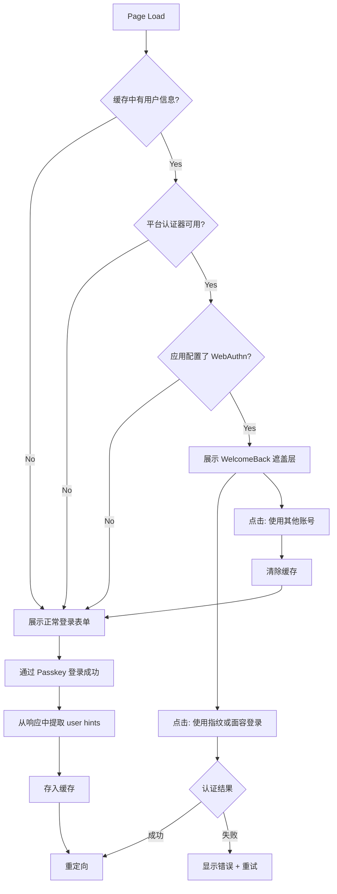

# Passkey Welcome Back 遮盖层设计

> 状态：RFC（待讨论） | 创建：2026-02-09

## 概述

当用户曾通过 Passkey 登录且当前设备有平台认证器时，用 "Welcome Back" 遮盖层替换登录表单，展示用户基础信息（nickname/picture），提供一键指纹/面容登录入口。

## 核心流程

用户通过 Passkey 登录成功 -> 后端在响应中注入 `nickname`/`picture` -> 前端缓存 -> 下次访问登录页检测条件 -> 满足则展示 WelcomeBack 遮盖层。

## 条件判断

三个条件全部满足时展示 WelcomeBack：

1. **有缓存的用户信息**：上次通过 Passkey 登录成功后缓存的用户信息
2. **当前设备有平台认证器**：`isPlatformAuthenticatorAvailable()` 返回 true
3. **应用配置了 webauthn/passkey connection**：从 connections 列表中检测



## 后端改动

### Challenge 发起时注入用户信息

当 WebAuthn challenge 发起时（`POST /challenge` with `type: webauthn`），如果提供了 `principal`（email），
后端已经知道用户身份。此时在 challenge 创建响应的 `Data` 字段中注入用户基础信息：

```go
// CreateResponse.Data 中注入
{
    "nickname": "用户昵称",
    "picture":  "头像 URL"
}
```

**注意**：不返回 email 等敏感信息。仅返回 nickname 和 picture。

**两种场景**：

| 场景 | 发起时有 principal? | 用户信息何时可知? |
|------|-------------------|-----------------|
| OperLogin (email 后 WebAuthn) | 有 email | 发起时即可返回 hints |
| Standalone Passkey (discoverable) | 无 | 验证完成后才知道用户 |

### 需要的改动

1. 扩展 `CreateRequest` 验证，支持 `webauthn` 类型
2. 在 Handler 的 `InitiateChallenge` 中，WebAuthn 类型走独立路径
3. 当有 `principal` 时，查找用户并在响应 `Data` 中注入 hints
4. Discoverable 场景，在验证成功后（`VerifyResponse.Data`）补充返回

## 前端改动

### WelcomeBack 组件

**位置**：`aegis-ui/src/pages/Login/components/WelcomeBack/`

展示内容：
- 用户头像（来自 `picture`，无则显示 nickname 首字母）
- 问候语："欢迎回来，[nickname]" 或 "欢迎回来"
- 主按钮："使用指纹或面容登录"（触发 Passkey 认证）
- 链接："使用其他账号登录"（清除缓存，切回正常登录表单）

### 组件层级

```
LoginPage
├── WelcomeBack (条件满足时展示，替换下方所有内容)
│   ├── Avatar + Nickname
│   ├── "使用指纹或面容登录" Button
│   └── "使用其他账号登录" Link
│
└── Normal Login Form (默认或 WelcomeBack 被关闭时)
    ├── Passkey (standalone)
    ├── OperLogin (EmailStep -> VerifyStep)
    └── IDP Buttons
```

### LoginPage 集成

- 新增 `showWelcomeBack` state
- 在 `useEffect` 中检测三个条件，满足则 `setShowWelcomeBack(true)`
- 渲染时：`showWelcomeBack ? <WelcomeBack /> : <正常登录表单>`
- `WelcomeBack` 的 Passkey 认证复用现有的 `handleManualPasskeyLogin` 逻辑

## 边界情况

- **首次访问**：无缓存 -> 正常登录表单
- **Passkey 被删除/吊销**：认证失败 -> 显示错误 + 提供重试/"使用其他账号"
- **设备无平台认证器**：条件不满足 -> 正常登录表单

## 开放问题

### 用户信息缓存方案

WebAuthn 规范出于隐私设计，不允许在用户交互前枚举或读取已存储的 Passkey 信息。
因此在 WebAuthn 交互前展示用户信息，需要通过服务端已知的信息（session cookie、已输入的 email 等）来获取。

**待讨论**：用户信息的前端缓存策略（localStorage vs cookie vs 其他）。
